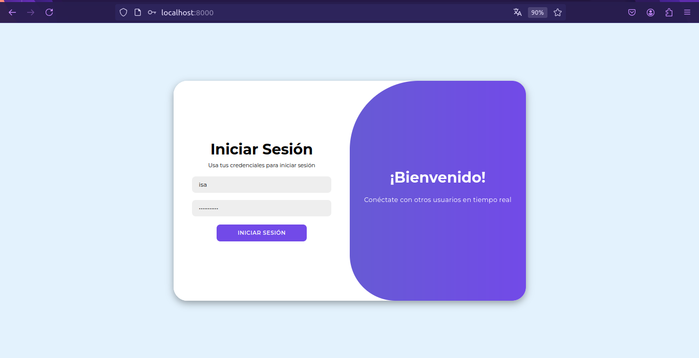
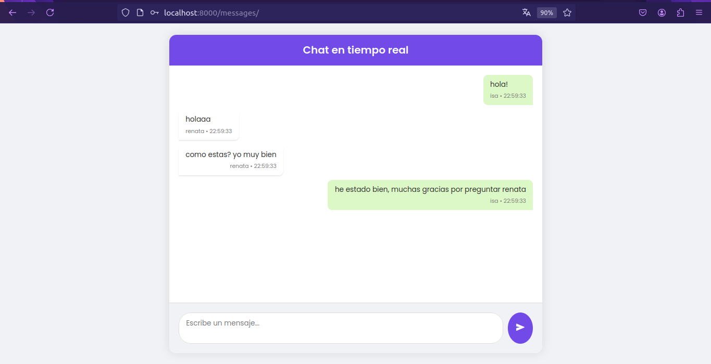

# Messenger Service API

Este es un pequeño y fácil proyecto de un chat en tiempo real que utiliza **Redis Cache** para almacenar mensajes y **Daphne** para manejar conexiones asíncronas. Es un servicio desarrollado con Django para manejar las funcionalidades del backend.

## 🛠️ Características
- Mensajería en tiempo real.
- Almacenamiento en caché de mensajes usando Redis.
- Sistema de usuarios con autenticación.

---

## 🚀 Primeros Pasos (Después de Clonar el Repositorio)
### 1. Crea y Activa un Entorno Virtual
  * Ejecuta `python -m venv env` para crear un entorno virtual llamado `env`.
  * Activa el entorno con `source env/bin/activate` (Windows: `env\Scripts\activate`).
### 2. Instala las Dependencias
  * Ejecuta `pip install -r requirements.txt` para instalar las librerías necesarias.
### 3. Configura la Base de Datos
  * Crea tu base de datos MySQL y configura las credenciales en el archivo `settings.py`.
### 4. Ejecuta las Migraciones de Django
  * Ejecuta `python manage.py migrate` para aplicar los cambios al esquema de la base de datos.
### 5. Crea un Superusuario
  * Ejecuta `python manage.py createsuperuser` para crear un superusuario inicial para acceso administrativo.
### 6. Inicia el Servidor de Desarrollo
  * Ejecuta `daphne messenger_service_api.asgi:application
` para iniciar el Servidor de Desarrollo con Daphne.
### 7. Accede al Panel de Autenticación
  * Abre tu navegador web y navega a `http://127.0.0.1:8000/` para acceder al panel de administración.

## Vista Login

